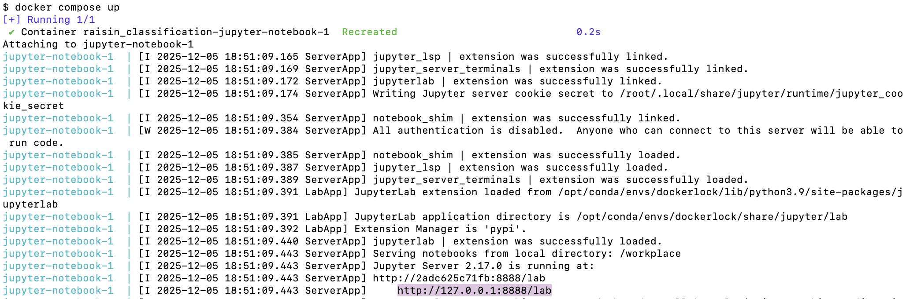

# Raisin Classification

Authors: Shreya Kakachery, Eric Wong, Yasaman Baher

## About

Analyzing images of raisins in order to classify them as Kecimen or Besni variety

## Usage

Follow the instructions below to reproduce the analysis.

## Setup

To ensure reproducibility, the entire project now runs inside a Docker container, replacing the need for local conda environments or local Python installations.

Follow the steps below to build, run, and update the project environment.

### 1. Prerequisites

Before running the analysis, install:

- Docker Desktop: <https://www.docker.com/products/docker-desktop>
- (Optional) conda-lock if you plan to update the environment locally.

### 2. Reproducible Environment Workflow

- environment.yml → conda-lock.yml → Dockerfile → Docker image

If you update the dependencies in `environment.yml`, regenerate the lockfile:

```bash
conda-lock -k explicit --file environment.yml -p linux-64
```

Commit the updated `conda-lock.yml`.

### 3. Build the Docker Image

To build the container locally, run:

```bash
docker build -t <dockerhub_username>/<image_name> .
```

This reads from `conda-lock.yml` to create a fully pinned computational environment.

### 4. Run the Container

```bash
docker run -it --rm \
    -p 8888:8888 \
    -v $(pwd):/home/jovyan/work \
    <dockerhub_username>/<image_name>:latest
```

Then open Jupyter in your browser:

```text
http://localhost:8888
```

Your project files inside the repository will appear in the container at:

```arduino
/workplace
```

### 5. GitHub Actions: Automate Image Publishing

This repository includes a workflow that automatically:

- Builds the Docker image
- Pushes it to DockerHub
- Tags it as latest
- Ensures a stable, shared environment for all team members

To enable this, the following GitHub Secrets must be configured:

- `DOCKER_USERNAME`
- `DOCKER_PASSWORD`

Once configured, images are automatically published whenever changes are pushed to main.

### 6. Using the Published Image

Anyone can pull the published image using:

```bash
docker pull <dockerhub_username>/<image_name>:latest
```

### 7. Running the Full Analysis

**Step 1: Navigate to the root of this project using the command line and enter the following command**

```
docker compose up
```

**Step 2: Look for a URL that starts with `http://127.0.0.1:8888/lab?token=`** <br>
Copy the full URL (including the token) and paste it into your browser to open Jupyter Lab.



**Step 3: Open the terminal inside Jupyter**


**Step 4: Run the following commands one at a time**
```
python scripts/sc1_data_acquisition.py \
    data/raisin.csv \
    data/raw/raisin_data.csv
```
```
python scripts/sc2_data_cleaning.py \
    data/raw/raisin_data.csv \
    data/processed/raisin_cleaned.csv
```
```
python scripts/sc3_data_validation.py \
    data/processed/raisin_cleaned_train.csv
```
```
python scripts/sc4_data_visualization.py \
    data/processed/raisin_cleaned.csv \
    results/figures
```
```
python scripts/sc5_model_fitting.py \
    data/processed/raisin_cleaned_train.csv \
    data/processed/raisin_cleaned_test.csv \
    results/models/raisin_model
```
```
quarto render ./analysis/raisin_classification_analysis.qmd --to html
quarto render ./analysis/raisin_classification_analysis.qmd --to pdf
```

Note: Windows/MacOS users may need to install TinyTex to successfully render PDF

```
quarto install tinytex 
```

## Clean up

To shut down the container and clean everything up, type `Ctrl + C` in the terminal where you launched it, then run `docker compose rm`.

## Report

The final report can be found at this [link](https://github.com/ybaher/raisin_classification/blob/main/crazy_raisins.ipynb).

## Dependencies

This project requires the following dependencies:

- Python 3.9
- Docker
- Conda
- The following data science packages:

```yaml
dependencies:
  - ipykernel=6.30.1
  - conda-lock=3.0.4
  - pip:
      - ucimlrepo==0.0.7
      - pandera
      - pandas==2.3.1
      - altair==5.5.0
      - numpy==2.0.2
      - scikit-learn==1.6.1
      - matplotlib==3.9.1
      - click
      - jupyterlab==4.5.0
      - vl-convert-python
      - tabulate
```

## License

This project’s source code is licensed under the MIT License. The documentation, reports, and written materials in this repository are licensed under the [Creative Commons Attribution 4.0 International (CC BY 4.0)](https://creativecommons.org/licenses/by/4.0/) license. See the [LICENSE](LICENSE) file for details.

## References

Charvet, A., Brogan Hartlieb, K., Yeh, Y. et al. A comparison of snack serving sizes to USDA guidelines in healthy weight and overweight minority preschool children enrolled in Head Start. BMC Obes 3, 36 (2016). <https://doi.org/10.1186/s40608-016-0116-2>

Chebil, S., Rjiba-Bahri, W., Oueslati, S. et al. Ochratoxigenic fungi and Ochratoxin A determination in dried grapes marketed in Tunisia. Ann Microbiol 70, 38 (2020). <https://doi.org/10.1186/s13213-020-01584-7>

Chibuluzo, S., Pitt, T. Raisin allergy in an 8 year old patient. All Asth Clin Immun 10 (Suppl 2), A6 (2014). <https://doi.org/10.1186/1710-1492-10-S2-A6>

Olmo-Cunillera, Alexandra et al. “Is Eating Raisins Healthy?.” Nutrients vol. 12,1 54. 24 Dec. 2019, doi:10.3390/nu12010054

Rodrigo-Gonzalo, M.J., Recio-Rodríguez, J.I., Méndez-Sánchez, R. et al. Effect of including a dietary supplement of raisins, a food rich in polyphenols, on cognitive function in healthy older adults; a study protocol for a randomized clinical trial. BMC Geriatr 23, 182 (2023). <https://doi.org/10.1186/s12877-023-03882-6>

Wijayabahu, A.T., Waugh, S.G., Ukhanova, M. et al. Dietary raisin intake has limited effect on gut microbiota composition in adult volunteers. Nutr J 18, 14 (2019). <https://doi.org/10.1186/s12937-019-0439-1>
